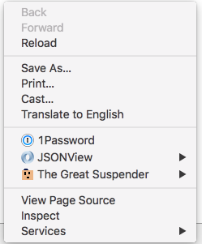
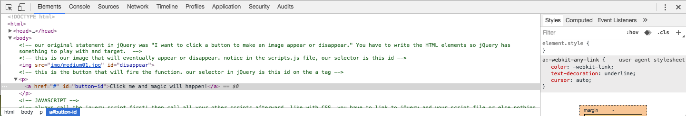
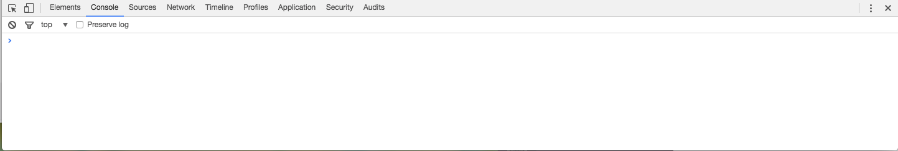
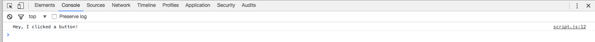
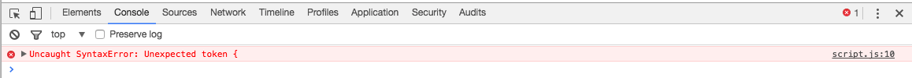
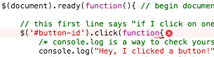
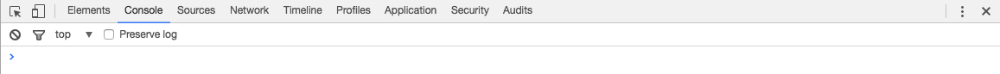

#jQuery Debugging 

Because sometimes (OK, lots of times) things break and you need to fix them!

---

##Debugging

In any coding situation, things may go awry - misspellings, missed punctuation, hanging chads (unclosed tags), etc. Learning to spot and fix these problems is important in any kind of web development.

In jQuery/JavaScript, debugging becomes even more important because the problems don't show themselves right away. Sometimes things just don't work without obvious flags. You need to learn to spot this.

---

##The Console

If you can't see what's wrong, how do you fix it? The answer lies in the **console**. Every browser has it, and in your js file, you can write code that will put something in the console so you can test if something is working.

---

##The Console

In Chrome, you can access the console by right-clicking anywhere on your screen and selecting "Inspect" to bring up the inspector:



---

##The Console

Once you open up the inspector, it looks like this:



---

##The Console

Click "Console" in the top horizontal menu to get to the actual console, which looks like this:



---

##Writing to the Console

You can write messages to the console by using the method **console.log**. The syntax for it looks like this:

```
console.log("Some kind of message here.");
```
---

##console.log

In general, you want to put a message in there that to let you know some kind of test passed. For instance, if I'm writing a jQuery script that's going to fire a function when I click an element, I might want to make sure something is happening when I click the element.

---

##console.log example

Here's how I would write a test to see if I'm clicking something correctly:

```
$('#button-id').click(function(){
	console.log("Hey, I clicked a button!");
});
```

---

##console.log example

Here, I'm checking to see if clicking something with an id of "button-id" works. If it does, I should see a message in my console.



See how the thing I wrote in console.log shows in the console?

---

##console.log

Using the console is a great way to test your jQuery every step of the way. If one test checks out, you can write your next line of code and test that. You can change your messages in the console as appropriate. If you see your message in the console, or the thing you're trying to do happens, you can move to the next step of your code.

---

##What if things go awry?

Knowing how to write to the console is one half of the story. You've also got to know how to figure out what went wrong. You'll usually fall into one of two scenarios:

1. Something is wrong with your jQuery syntax.
2. You probably misspelled a selector, chose a selector that didn't exist, or just have some kind of selector problem.

---

##Your syntax is bad

The first problem is usually the easiest to spot in the console because it will at least give you a hint and even tell you what line the problem is on.

Let's use our previous example:

```
$('#button-id').click(function(){
	console.log("Hey, I clicked a button!");
});
```

---

##Your syntax is bad

Say I introduced a jQuery error here, like I forgot the parentheses after the word function:

```
$('#button-id').click(function{
	console.log("Hey, I clicked a button!");
});
```

---

##Your syntax is bad

If I look at my console, I'll see something like this:



---

##Your syntax is bad

Suddenly, you'll notice a lot of red errors! The first one is the circle with the red X telling you there is 1 error. 

The more helpful one is the thing that says "Uncaught SyntaxError: Unexpected token {". You may not necessarily know what that means, but in general, if you see "Unexpected token," it means jQuery was expecting some kind of punctuation but saw something else instead and got confused.

---

##Your syntax is bad

The other great thing about those red lines is that it tells you where the error is. Look to the right of the error line and you'll notice "script.js:10". This means the error is in your script.js file on line 10. If you click that, it'll actually show you where the error is:



See the red X? It tells you the error is somewhere on that line, and the squiggly red line tells you the error is probably in that general vicinity. (In this case, we forgot the empty parentheses after function.)

---

##Your syntax is bad

Sometimes, when you clean up one error, another one may pop up. That's OK. jQuery stops running as soon as it sees an error. If you have other syntax problems, they'll show up as soon as you fix the first one.

---

##Your selector is bad

The console is great for finding out you have a jQuery syntax error, but what if you just have a bad selector? That's a little more tricky. Say I just typed my selector incorrectly in my original example:

```
$('button-id').click(function(){
	console.log("Hey, I clicked a button!");
});
```

In this case, I forgot the # for my id (button-id).

---

##Your selector is bad

If I look in my console, I won't see errors pop up:



I know something is wrong though, because I clicked my element and I didn't see my console.log message show in the console! D'oh!

---

##Your selector is bad

When this happens to you, the problem is pretty likely in your selector. Since that's not an actual jQuery error, it won't show you any red flags. The flags only show for jQuery errors, not user typo errors. :)

---

##Tips and Takeaways

Always use your console! 

Write a console.log command for every step of the function. Test one step, make sure it works, and then move on to the next step in your function.

---

##Tips and Takeaways

Know how to read the console and the errors it shows and doesn't show you.

* If you see an error in the console, the problem is likely a jQuery syntax problem. Check the verb side of your programming sentence (on the right side of the period).
* If you don't see an error in the console, the problem is likely a selector problem (misspelling, mistyping). Check the noun side of your programming sentence (on the left side of the period).
