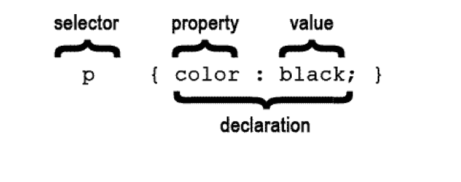

#HTML & CSS BASICS 

```
<p>Hello world!</p>
```

---


##Where to Find These Slides!

If you'd like to refer to these slides later, you can find them at:

**http://jrosebud.github.io/j553**

---

##Intros


---

##Your Prof

Jenn de la Fuente

jdelafue@usc.edu

Office: ANN 204A, 2nd floor of the Media Center

Hours by appointment only.

---

##Text Editors

Having a text editor is pretty important to coding. There are a couple of free ones out there:

You can get Sublime Text at [http://www.sublimetext.com/](http://www.sublimetext.com/) 

Or there's [Brackets](http://brackets.io/).

---

#HTML Basics

---

##HTML Syntax


---

##HTML Syntax


---

##Organization Will Set You Free

(So the adage goes.)

In web development, organization **cannot** be overstressed. Always put your project in a folder. Put your images in a folder, put your scripts in a folder, put your CSS files in a folder. Here's a basic template structure you can use for instant website fodder:

https://github.com/usc-annenberg-journalism/basic-web-tpl-2016

---

##Home Base

Every site on the internet starts with a file called index. Sometimes it has a different ending extension, like index.php, index.asp, index.rb. For our purposes, ours will be index.html. 

When you go to any URL, the browser is looking for that index file to display your home page. That's how it knows to phone home.

Make sure your project folder has an index.html file!

---

##Folders in Folders (a.k.a Inception)


---

##Basic HTML Page Structure

There are a few tags you should be aware of and starting to use when you code your pages. There is a basic structure to HTML, and it goes something like this:

```
<!DOCTYPE html>

<html>

<head>
</head>

<body>
</body>

</html>
```

---

##Basic HTML Page Structure

"What is this DOCTYPE business?", you may ask.

DOCTYPE simply lets a browser know we're using HTML5, the latest web standard. HTML5 allows for a few nifty things, like certain tags and some fancy form stuff you don't need to know right now.

In the old days, this line used to be very long. Now it's just !DOCTYPE html. Nice and simple.

---

##Basic HTML Page Structure

In general, **all** your written HTML goes inside the `<html>` tags.

The `<head>` tags are reserved for things that are important but don't necessarily render onto the page. The `<head>` is often where CSS stylesheets are linked, scripts get linked, and the `<title>` ... `</title>` tag resides, which puts a title in the tab or top bar of a browser window.

The `<body>` tag is the body of your site ... in other words, it's where all the stuff the general public actually sees and what a browser renders.

---


##Content Tags

Heading Elements

```<h1>```Largest Heading```</h1>```

```<h2>``` . . . ```</h2>```

```<h3>``` . . . ```</h3>```

```<h4>``` . . .```</h4>```

```<h5>``` . . . ```</h5>```

```<h6>```Smallest Heading```</h6>```

--

##Content Tags

Text Elements

```<p>```This is a paragraph```</p>```

```<br>``` This is a line break. Notice it doesn't need a closing tag.

--

##Content Tags

Unordered list

```<ul>``` ```</ul>```

In other words, a bulleted list. It looks like this:

- List item
- List item

--

##Content Tags

Unordered list item

```
<ul>
<li>First item</li>
<li>Next item</li>
</ul>
```


--

##Content Tags

Links

 ```<a href="Link">```First item```</a>```
 
 If you want a link to open in a new window or tab, you add ```target="_blank"```.
 
 ```<a href="link" target="_blank">Item</a>```


--

##Content Tags

Images

To put an image on an HTML page, you use the `````` tag:

``````

The src is the path to the image.

--

##Content Tags

Other helpful tags

You might want to put all your content inside one tag. I like to use the ```<section>``` tag or ```<div>``` tag for this.

---

##HTML Basics - Images

The `img` tag requires a `src` attribute, which tells the browser where to find the image to be placed.

---

##HTML Basics - Images

*	Inside your root folder, a relative path could be used:
	
####``````

---

##HTML Basics - Images
Relative Path
	


---


##HTML Basics - Images
Full URL

		
		
If you do this, make sure that you have permission to use the image in this way. Even then, it is often better to host a copy of the same image, rather than link to another server, because it reduces dependency.

---

##HTML Basics - Images

```alt``` attribute

	
	
The `alt` attribute is for visually impaired people who have to browse the internet using a text reader. Since they can't see the photo, the text reader reads the alt text to them. Generally, put the description of the photo (for instance, "Company Logo") as the `alt` attribute.

The ```alt``` attribute is also good for Google indexing.

---

##HTML Basics - Images

Reasons an image may not load: 

*	There was a connection error, the browser didn't download the image.

*	The file was not found, perhaps because the image got moved elsewhere and the page wasn't updated yet to reflect the change.

---

##HTML Basics - Images

There are three main image file formats:

---

##Image File Formats

####.png

* Supports transparency and is still high-quality. Use it for logos or icons, or anything that needs to be high-quality and has to have a transparent background.

<aside class="notes">
Supports transparency and semi-transparency, great for logos, icons, and repeating background tiles. Almost always preferable to a `gif`, unless semi-transparency is not needed, and the `gif` format is significantly smaller.
</aside>

---

##Image File Formats


####.gif

*	Can have basic transparency, typically a `png` is used instead. You can of course use this for animated gifs. But don't use it for photos because the quality is terrible!

---

##Image File Formats

####.jpg

* Web format for all photos. Be reasonable with your sizing! Don't upload something that's 3MB. In general, a good rule of thumb is no more than 1200 pixels wide at 72 dpi resolution. If you're worried about retina screens, save your photos at 125 or 150 dpi.

<aside class="notes">
No transparency, can be stored at different compression levels with varying amounts of "lossy-ness", typically the best format for photos. (Try to balance between photo quality and file size.)
</aside>

---


##CSS

If HTML is the framework of a house, CSS is the paint and other things that makes it a unique house. (Is it red? How many bedrooms?)

---

##CSS



---

##CSS

It's best practice to put CSS in its own file and link to it from the `<head>`.

```<link rel="stylesheet" href="style.css">```
	
---

##CSS Break Down

```
p {
	color: red;
	font-weight: bold;
}
```
---

##CSS Break Down

The **selector**, `p` in this case, specifies what parts of the HTML document should be styled by the declaration. This selector will style all `p` elements on the page.


---


##CSS Break Down

#### Declarations

Every declaration is a **property** followed by a **value**, separated by a colon, ending in a semicolon.

---

##Cascading Style Sheets (CSS)
###Colors

Colors can be specified in CSS in a variety of ways:


<aside class="notes">
* keyword
* hex codes
* rgb
* hsl
* rgba
* hsla

</aside>

---

##Color
###Color Keywords

These are used less frequently, but are handy for basic colors like `black` and `white`. There are several

See [here](http://msdn.microsoft.com/en-us/library/ie/aa358802.aspx) for more

---

##Color
###Hex Codes (RGB)


<aside class="notes">
"Hex" values are so-called because they use hexadecimal, or base-16, to describe the color values for red, green, and blue. Each of the 3 color values is expressed by two hexadecimal digits, from `00` (no color) to `FF` (full color), and are written in the order red, green, then blue, after an initial `#` sign.

Hex values can be abbreviated to only 3 digits if each digits is doubled. So `#FFFFFF` (white) can be expressed more succinctly as `#FFF`, and `#000000` (black) can be expressed as `#000`. `#FA6198`, however, cannot be abbreviated without altering the color.

</aside>

---

##Color
###RGB Color Values

####```rgb(0,0,0)```

*	The first value is red, the second green, the third blue.
 
*	Each value can range from 0 to 255, which expresses the same number of color steps as 00 to FF in base-16.


<aside class="notes">
FF in base-16 is equivalent to 255 in base-10.

In RGB, `rgb(0,0,0)` is black, `rgb(255,255,255)` is white, `rgb(255,0,0)` is red, etc.

White-space is allowed *inside* the parentheses, so `rgb(255, 0, 0)` will do just as well.
</aside>

---

##Color
###RGBa Colors


*	RGBa works identically to RGB, expect that it takes a 4th value called the "alpha".
*	This is a value between 0 and 1 which will be used to determine a color's opacity on the page. 0 is completely transparent (invisible), 1 is totally opaque (solid). 0.5 would be 50% opacity.


<aside class="notes">
0 is completely transparent, and 1 being solid. 0.5 or .5 is 50% opacity.

Thus, __rgba(0,0,0,.25)__ is black at 25% opacity and __rgba(255, 255, 255, 0.8)__ is white at 80% opacity.

The alpha value can be in decimal form but cannot use a percentage. When a decimal is used, the leading zero is optional.
</aside>

---

##Fonts

There is a set of basic fonts that can be read across just about all browsers.

To declare a font for a webpage, you usually assign it to the ```<body>``` tag using the ```font-family``` attribute, like this:

```
body {
    font-family: "Georgia", serif;
}
```

---

##Web Safe Fonts

There are about 12 fonts that can be safely declared in the font-family attribute because they're available across all browsers. You can read more about that here:

http://www.w3schools.com/cssref/css_websafe_fonts.asp

You can also use Google Fonts:

http://google.com/fonts

---

##Divide and Conquer

There are many tags you can use to section off your content. We've talked about a few of these already, such as ```header```, ```footer```, ```section```, ```article```. There are two other tags that you'll use a lot, maybe even more than those HTML5 tags:

* div
* span

---

##Block and inline elements

Many tags are __block elements__ by default in HTML. Examples of these tags are: ```p```, ```ul```, ```div```, ```header```, ```footer```, ```article```, ```h1``` (and all the h tags). 

Think of them as giant boxes. They are good containers. They also tend to occupy the entire width of your page by default (unless you tell it not to). This often means they sit on their own line and push everything else out of their way.

---

##Block and inline elements

__Inline elements__ play nice with other content. They tend to sit within block elements. As the name implies, they sit in line with whatever surrounds them. Examples of inline elements are these tags: ```a```, ```img```, ```span```.

---

##Div vs. Span

###Div

* Divs are block elements. Think of them as divas (div = diva, get it?). 
* Like all good divas, divs like to be on their own line and push everything out of the way. They occupy the stage alone. 

---

###Span

* Spans are inline elements. They're helpful for when you want make something look different within a div (or any block element, for that matter), but you don't want that styled thing to sit on its own line. 

---

##Span example

Say you had an h1 tag that had a specific style attached to it (like it was bold and the color blue). But maybe you want one word in your h1 tag to be a different color.

If you used a div with a class attribute, it would force a line break in the word that was surrounded by the div tags. But using a span around that single word would keep it in line with all the other text while still allowing you to add a class attribute to it (and change the style of that single word).

---

##class & id

With classes and ids we can target specific elements on a page, so we can manipulate it uniquely.

Remember, you can add a class or an ID to any HTML tag. By doing this, you would "override" any CSS rules applied to that particular tag.

---

##class & id


---

##class & id

###IDs are unique

Usually, you add an ID to something going to be used only once in your entire HTML page. (Note: This becomes pretty important in JavaScript and dynamic programming.)


###Classes are not unique

Re-use classes all you like. If you have a CSS rule you'd like to apply to many elements, regardless of what tag it's applied to, use a class.

---

##class & id

How to __select__ classes and ids in CSS

```
.className
#idName
```