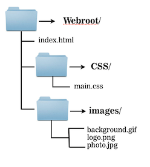

#HTML & CSS BASICS 

```
<p>Hello world!</p>
```

---


##Where to Find These Slides!

If you'd like to refer to these slides later, you can find them at:

**http://jrosebud.github.io/j553/week1**

---

##Text Editors

Having a text editor is pretty important to coding. There are a couple of free ones out there:

You can get Sublime Text at [http://www.sublimetext.com/](http://www.sublimetext.com/) 

Or there's [Brackets](http://brackets.io/).

---

#HTML Basics

---

##HTML Syntax


---

##HTML Syntax


---

##Organization Will Set You Free

(So the adage goes.)

In web development, organization **cannot** be overstressed. Always put your project in a folder. Put your images in a folder, put your scripts in a folder, put your CSS files in a folder. Bonus: If you keep a copy of this folder easily accessible, you can copy it and have instant website fodder!

---

##Home Base

Every site on the internet starts with a file called index. Sometimes it has a different ending extension, like index.php, index.asp, index.rb. For our purposes, ours will be index.html. 

When you go to any URL, the browser is looking for that index file to display your home page. That's how it knows to phone home.

Make sure your project folder has an index.html file!

---

##Folders in Folders (a.k.a Inception)



---

##Basic HTML Page Structure

There are a few tags you should be aware of and starting to use when you code your pages. There is a basic structure to HTML, and it goes something like this:

```
<!DOCTYPE html>

<html>

<head>
</head>

<body>
</body>

</html>
```

---

##Basic HTML Page Structure

"What is this DOCTYPE business?", you may ask.

DOCTYPE simply lets a browser know we're using HTML5, the latest web standard. HTML5 allows for a few nifty things, like certain tags and some fancy form stuff you don't need to know right now.

In the old days, this line used to be very long. Now it's just !DOCTYPE html. Nice and simple.

---

##Basic HTML Page Structure

In general, **all** your written HTML goes inside the `<html>` tags.

The `<head>` tags are reserved for things that are important but don't necessarily render onto the page. The `<head>` is often where CSS stylesheets are linked, scripts get linked, and the `<title>` ... `</title>` tag resides, which puts a title in the tab or top bar of a browser window.

The `<body>` tag is the body of your site ... in other words, it's where all the stuff the general public actually sees and what a browser renders.

---


##Content Tags

Heading Elements

```<h1>```Largest Heading```</h1>```

```<h2>``` . . . ```</h2>```

```<h3>``` . . . ```</h3>```

```<h4>``` . . .```</h4>```

```<h5>``` . . . ```</h5>```

```<h6>```Smallest Heading```</h6>```

--

##Content Tags

Text Elements

```<p>```This is a paragraph```</p>```

```<br>``` This is a line break. Notice it doesn't need a closing tag.

--

##Content Tags

Unordered list

```<ul>``` ```</ul>```

In other words, a bulleted list. It looks like this:

- List item
- List item

--

##Content Tags

Unordered list item

```
<ul>
<li>First item</li>
<li>Next item</li>
</ul>
```

--

##Content Tags

There are also ordered lists, which give you a numbered list by default (as opposed to a bulleted unordered list). They look exactly like unordered lists, except they use the `<ol>` tag instead:

```
<ol>
<li>First item</li>
<li>Next item</li>
</ol>
```


--

##Content Tags

Links

 ```<a href="https://google.com">```First item```</a>```
 
 If you want a link to open in a new window or tab, you add ```target="_blank"```.
 
 ```<a href="https://google.com" target="_blank">Item</a>```


--
##Content Tags

**Bold and italic**

These work just like the `<a>` tag, you wrap them around your content.

Bold uses the `<strong>` tag:

 ```<strong>I'm bold!</strong>```
 
Italic uses the `<em>` tag:
 
 ```<em>I'm italic!</em>```


--

##Content Tags

Images

To put an image on an HTML page, you use the `````` tag:

``````

The src is the path to the image.

--

##Content Tags

Other helpful tags

You might want to put all your content inside one tag. I like to use the ```<section>``` tag or ```<div>``` tag for this.

---

##HTML Basics - Images

The `img` tag requires a `src` attribute, which tells the browser where to find the image to be placed.

---

##HTML Basics - Images

*	Inside your root folder, a relative path could be used:
	
####``````

---

##HTML Basics - Images
Relative Path
	


---


##HTML Basics - Images
Full URL

``
		
If you do this, make sure that you have permission to use the image in this way. Even then, it is often better to host a copy of the same image, rather than link to another server, because it reduces dependency.

---

##HTML Basics - Images

```alt``` attribute

``
	
The `alt` attribute is for visually impaired people who have to browse the internet using a text reader. Since they can't see the photo, the text reader reads the alt text to them. Generally, put the description of the photo (for instance, "Company Logo") as the `alt` attribute.

The ```alt``` attribute is also good for Google indexing.

---

##HTML Basics - Images

Reasons an image may not load: 

*	There was a connection error, the browser didn't download the image.

*	The file was not found, perhaps because the image got moved elsewhere and the page wasn't updated yet to reflect the change.

---

##HTML Basics - Images

There are three main image file formats:

---

##Image File Formats

####.png

* Supports transparency and is still high-quality. Use it for logos or icons, or anything that needs to be high-quality and has to have a transparent background.

<aside class="notes">
Supports transparency and semi-transparency, great for logos, icons, and repeating background tiles. Almost always preferable to a `gif`, unless semi-transparency is not needed, and the `gif` format is significantly smaller.
</aside>

---

##Image File Formats


####.gif

*	Can have basic transparency, typically a `png` is used instead. You can of course use this for animated gifs. But don't use it for photos because the quality is terrible!

---

##Image File Formats

####.jpg

* Web format for all photos. Be reasonable with your sizing! Don't upload something that's 3MB. In general, a good rule of thumb is no more than 1200 pixels wide at 72 dpi resolution. If you're worried about retina screens, save your photos at 125 or 150 dpi.