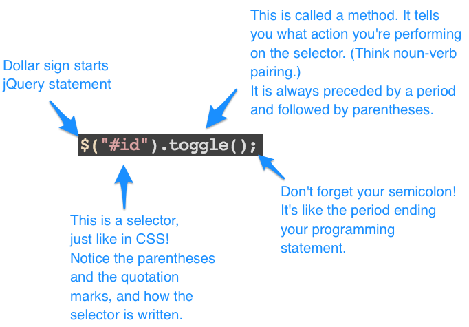

#jQuery 

It's like JavaScript, only way easier.

---

##jQuery


jQuery __is__ JavaScript.

jQuery is a JavaScript library designed to simplify the client-side scripting of HTML.

In other words, jQuery combines a lot of things in the background to make writing functions and doing commands a lot easier than if you wrote it in straight up JavaScript.

---

##jQuery

What can you do with jQuery? Lots of cool stuff! 

Many slideshows, carousels, motion, animations, and general "cool stuff" you can interact with on the web are written in jQuery. As mentioned before, jQuery is the verb of the web world.

(It also works in most browsers and devices. Pretty cool, eh?)

---

##How to Add jQuery to Your Site

You could download the jQuery file from jquery.com and add it like any other script:

```
<script src="js/jquery.js"></script>
```

The templates you will work with in this class have jQuery already loaded in the js folder. You just have to call it in the html file, like you would with a stylesheet!

---

##jQuery Basics

###$

The dollar sign tells you there's some jQuery coming. jQuery statements start with it.

---

##jQuery Basics



---

##jQuery

When you want to select an element with jQuery to manipulate it, you use the same conventions as you would for CSS.

Remember, in jQuery, you must target something or else your script is for naught!

```
$(".class").click();
$("#id").toggle();
$("p").show();
```
---

##jQuery

And, like with JavaScript, you'll usually put the function after all the HTML tags have rendered (so toward the bottom of your document.)

---

##Useful jQuery Methods

There are a myriad of methods you can do in jQuery once you've selected something to manipulate. You can change a CSS property, add an attribute, add or remove a class to an element, hide it, show it, etc.

---

##Useful jQuery Methods

If you want to manipulate the CSS of an element, you would use ```.css```:

```
$("p").css("color", "#333");
```

The syntax when using ```.css``` is:
```.css("attribute", "value");```

---

##Useful jQuery Methods

You can manipulate more than one CSS attribute using  ```.css```. The syntax looks like this:

.css({ "attribute" : "value", "attribute" : "value" });

Example:

```
$(".box").css({
	"color" : "#333",
	"background" : "#999"
});
```

---

##Useful jQuery Methods

To show and hide elements, there are two different sets of functions you can use. 

```.show()``` / ```.hide()``` / ```.toggle()```

or 

```.slideUp()``` / ```.slideDown()``` / ```.slideToggle()```

or 

```.fadeIn()``` / ```.fadeOut()``` / ```.fadeToggle()```

These are the equivalent of setting ```display: block``` (show) and ```display: none``` (hide) in CSS.

---

##Useful jQuery Methods

The only difference between show/hide and slideUp/slideDown is how the element appears and disappears.

show/hide is like taking the bottom right corner of the box and dragging it out to reveal the item or hide the item.

slideUp/slideDown is the equivalent of taking the bottom edge of the element and dragging it downward or upward to show or hide it.

fadeIn/fadeOut affects the opacity of the element.

---

##Useful jQuery Methods

Remember that ```.toggle()``` toggles only between ```.show()``` and ```.hide()```.

Conversely, ```.slideToggle()``` toggles between ```.slideUp()``` and ```.slideDown()```.

Lastly, ```.fadeToggle()``` toggles between ```.fadeIn()``` and ```.fadeOut()```.

---

##Useful jQuery Methods

The show/hide, slide, and fade functions can take a speed parameter. This controls how fast the item appears and disappears.

This speed is measured in milliseconds. So, 1 second is 1000 milliseconds. The fastest speed you can indicate is 100. The syntax is as follows:

```
$(".open").hide(100);
```

You can also use 'fast' or 'slow':

```
$(".peekaboo").slideToggle('fast');
```

---

##Useful jQuery Methods

Fast = 200 milliseconds

Slow = 800 milliseconds

**Remember:**

1 second = 1000 milliseconds.
So ```$('.open').hide(5000);``` means it will take 5 seconds for your element to disappear.

---

##Conjunction Junction, What's Your Function?

You can write all the jQuery statements you like, but at some point, you will need to combine these statements to actually perform a task.

This combination of statements is called a **function**.

---

##Functions!

Before you write a function, it's important to think in plain English what you want this function to do and write out its steps. You essentially want to think in plain English and then translate into jQuery. This process is called pseudocoding, and it's crucial to trying to learn how to do stuff in jQuery.

---

##Functions!

Here's a pseudocoding example. Let's talk in plain English first.

**"I want to click a button and make an image on my page disappear. I then want to click that same button to make that image on my page reappear."**

---

##Functions!

Let's break down that desire into several small tasks:

* I'm clicking a button
* That makes an image disappear
* I'm clicking the same button
* That makes the image reappear

Makes sense, right? Each item in this list is distilled to a **single action**.

---

##Functions!

We already know how to handle two of those tasks:

* Make an image disappear
* Make an image reappear

What jQuery method can handle that?

---

##Functions!

The other two tasks are the start of our function:

* I'm clicking a button 
* I'm clicking the button again

---

##Functions!

This is generally what a function looks like:

```
$("#button-id").click(function(){
	$(".something").fadeToggle(1000);
});
```

---

##Functions!

Notice the key word in our first task: "I'm **clicking** a button."

There is a method in jQuery called ```.click()```. As the name implies, it makes something happen when you click an element.

(There is also ```.hover()```, which fires when you hover over an element.)

---

##Functions!

If we go back to the first line of the function:

```
$("#button-id").click(function(){
```

In plain English, this translates to:

"I'm selecting an element with the id of "button-id" and when I **click** it, some function is going to happen."

---

##Functions!

Inside the curly brackets are the tasks you want to perform when this element (in this case, something with the id of "button-id") is clicked. In this case, we wanted this to happen:

* Make an image disappear
* Or, make the image reappear

---

##Functions!

Just like you'd write a CSS rule inside curly brackets, you write your jQuery command inside the curly brackets!

```
$("#button-id").click(function(){
	$(".something").fadeToggle(1000);
});
```

Don't forget the closing punctuation that's all on the last line.

---

##Functions!

You've written your first function! Hooray!

---

##Tips and Takeaways

* jQuery is best written in a separate file, usually something called scripts.js that's in a js folder.
* Don't forget to call the jQuery library and your scripts.js file in your HTML. Connect them to your HTML the way you would your CSS.
* Don't leave home without selectors in jQuery. These selectors are the same as they would be in CSS (tags, classes, and ids).

---

##Tips and Takeaways

* Pseudocode is your best friend. Think about what you want to do in plain English first. What element are you targeting and what do you want to happen when that element is clicked or hovered over?
* The noun-verb analogy is a great one to follow. The noun is your HTML element. The verb is the jQuery method. 
* Take a breath, go step by step. Just like a sentence is one action, one thought, so is a jQuery command. Make the "sentences" in your functions do one thing at a time.