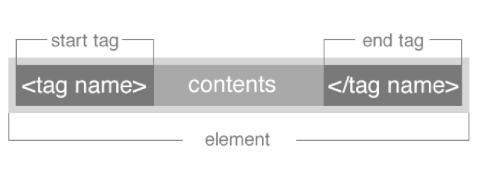

#FEWD - HTML BASICS 

```
<p>Hello world!</p>
```

---


##Agenda

- Introductions
- Housekeeping
- What to Expect in This Class
- Intro To Web Development
- HTML Tags
- Lab Time


---


##Introductions

<div align="center"></div>

---

##Meet the Instructors

**Instructor:** Jenn de la Fuente

- Email: designs@jrosebud.com
- Website: http://jenndelafuente.com
- Twitter: [@dabblingdesign](http://twitter.com/dabblingdesign)

---

**TAs**

Ethan Stiffelman

Ray Dipasupil

- Email: Raydipasupil@gmail.com
- Website: http://stancetrader.com
- Twitter: [@914rdd](http://twitter.com/914rdd)

---

##Housekeeping

###You must have a text editor of some variety for this class!

If you don't, get Sublime Text 2 at [http://www.sublimetext.com/2](http://www.sublimetext.com/2)

Otherwise, use what you've always been using if you already have a text editor preference.

---

##Schoology

- We'll post files for class there.
- You'll turn in homework to Schoology as zip files.
- We'll post resources and links too.
- Class will be recorded (barring any technical difficulties), and links to the slides can be found on Schoology.
- You can also find the slides at http://jrosebud.github.io

---


##What to Expect

(We don't bite, really.)

---

##Objectives

- You'll learn how to read HTML and CSS.
- You'll know enough about JavaScript and jQuery to at least interpret it. Maybe you can't write a JavaScript script from scratch, but you'll at least know what's going on and how to manipulate and existing scripts for your own purposes.
- You'll be able to create a nice, multi-page website.
- You'll learn the basic workflow when someone says to you "Hey, can you build a website for me?"

---

##What you **Won't** Learn

- Dynamic coding! (That means you can't build a WordPress site or content management system!)
- Back-end web development (PHP, Ruby, Python, C++, and similar languages)

---

##HTML Basics

---


##HTML vs HTML5

HTML5 is HTML with a few additions
The Doctype tells you if the page is HTML5 ready.


```<!DOCTYPE html>```


##HTML HISTORY


<aside class="notes">
image retrieved from http://www.onbile.com/info/wp-content/uploads/2013/09/Timeline-of-web-technologies-639x168.jpg on October 1, 2013.

</aside>

---

##HTML Tags

---


##General Assembly Press Release

---


##HTML Syntax



---

##HTML Syntax


---

##Content Tags

Heading Elements

```<h1>```Largest Heading```</h1>```

```<h2>``` . . . ```</h2>```

```<h3>``` . . . ```</h3>```

```<h4>``` . . .```</h4>```

```<h5>``` . . . ```</h5>```

```<h6>```Smallest Heading```</h6>```

--

##Content Tags

Text Elements

```<p>```This is a paragraph```</p>```

```<code>```This is some computer code```</code>```

--

##Content Tags

Unordered list

```<ul>``` ```</ul>```

--

##Content Tags

Unordered list item

	```<li>```First item```</li>```
    ```<li>```Next item```</li>```


--

##Content Tags

Links

 ```<a href="Link">```First item```</a>```
 
 If you want a link to open in a new window or tab, you add ```target="_blank"```.
 
 ```<a href="link" target="_blank">Item</a>```


--


##Cookie Recipe

---

## Homework

*	Create a resume website
*	Watch a video about the Internet at http://www.youtube.com/watch?v=7_LPdttKXPc

---