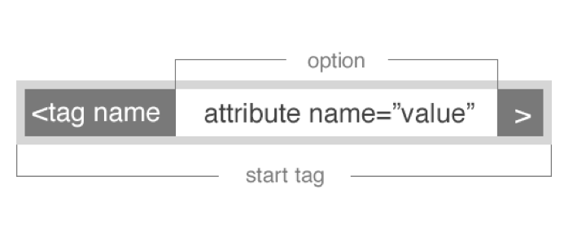

#FEWD - Layout

Floats, positioning, classes, IDs, oh my!

---


##Agenda

*	Review
*	Classes Ids
*	HTML5 Structural Elements
*	Floats
*	Lab Time

---


##class & id

With classes and ids we can target specific elements on a page, so we can manipulate it uniquely.

Remember, you can add a class or an ID to any HTML tag. By doing this, you would "override" any CSS rules applied to that particular tag.

---

##class & id



---


##class & id

---

##class & id

####IDs are unique

Usually, you add an ID to something going to be used only once in your entire HTML page. (Note: This becomes pretty important in JavaScript and dynamic programming.)

####Classes are not unique

Re-use classes all you like. If you have a CSS rule you'd like to apply to many elements, regardless of what tag it's applied to, use a class.

---

##class & id

How to __select__ classes and ids in CSS

```.className```

```#idName```

---

##HTML5 Structural Elements

Adding structure to HTML elements that are related to content layout.

*	header
*	aside
*	footer

---


##Floats

Float is a CSS positioning property, used to layout a web page. 


<aside class="notes">
Image from Chris Coyier's CSS-Tricks
</aside>

---


##Floating Sections

---

##Div Up The Content

*	When Do I need a Div, Section or Article?

*	When do I need a class or id?

---


##Fashion Blog

---
