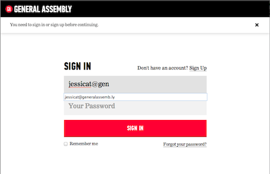
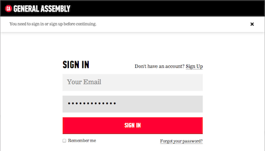
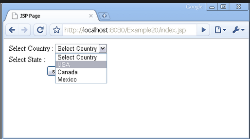

#FEWD - Forms & Inputs

Because at some point, you need to ask users to give you data, right?

---


##Forms

Forms are how we can get data from users.


---

##Forms

Forms tell the page: 

*	Where to send the data
*	How to send it
*	What is being sent

---

##Form Tag


Available Attributes

*	Method
*	Post,get,put,delete
*	Action
*	Url to send data to
*	Enctype
*	Multipart/form-data if uploading files

---


##Form Tag

In Action

```
<form action="register.php" method="post" enctype="multipart/form-data">
	Data collection elements go here
</form>
```

---

##Inputs

*	Place between ```<form> </form>``` tags

*	Attributes
	*	Type: Text, submit, password, email, checkbox, button, radio, file, etc
	*	Name
	*	Placeholder
	*	Value

Complete Spec: http://www.w3schools.com/tags/tag_input.asp

---


##Text

Use value to set initial text


---

##Email

Allows browser to autofill field





---

##Password

Hides characters as typed




---

##Submit vs File vs Button

*	Value is the button text. ```<input type="submit" value="Submit">```


*	Creates a file upload element ```<input type="file">```


*	Creates clickable button ```<input type="button">```

---

##Select and Option



---

##Select and Option


---

##Labels

Information about the input field should be put in a ```<label>``` tag

To tie the two together choose one of these methods:

```<label>Name <input type="text" name="yourName"></label>```

```<label for="yourName">Name</label><input type="text" name="yourName" id="yourName">```

<aside class="notes">
Usability
Clicking the label text in either case places the focus in the input field (great for radio buttons)
</aside>

---

##Styling

*	Elements that can't be styled directly
	*	Checkboxes, File upload inputs, Radio buttons

<aside class="notes">
*	Number of ways to do this *instructor can cover all or just choose one
	1.	Opacity 0 on the element, set it's height and width to define clickable area, set the height and width of it's parent to be the same as the input (don't forget position relative). Style the parent.
	2.	Hide the element, style a corresponding label how you wanted the element to appear
	3.	Try using pseudo elements and the selector :checked for no JS switching between checked and unchecked images used for styling
</aside>

---


##Form Validation

Most form validation is handled using JavaScript. Validation checks for things like empty fields that are required and whether a legit email is put in the email field.

It's often easiest to use a ready made script to validate a form. Parsley.js (http://parsleyjs.org/) is an example of one, but you can Google several others.

---

##Form Processors

A note about forms:

Just because you write a form doesn't mean it can automatically send the data to someone! You need what's called a form processor. These are often written in a back-end coding language such as PHP or Ruby or ASP. These processors take what's written in the fields and send it out in an email message (or insert the data in a database if you're feeling really fancy).

---

##Form Processors

Basic form processors simply send an email to someone when a form is filled out. This is all that most people need.

There are a few simple PHP processors out there. You don't need to know PHP to use them. You can Google a few, but one nice one can be found here: https://github.com/erikreagan/Catch-All-PHP-Form-Processor

---

##Form Processors

The alternative to hosting your own form and using a separate processor is to use a form building service. Most of these have free versions of their services, but depending on how complex your form needs are, you may have to step up to a paid account.

Two processors to look at:

- **Wufoo:** http://www.wufoo.com
- **JotForm:** http://www.jotform.com