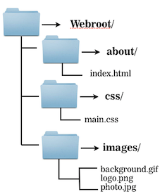
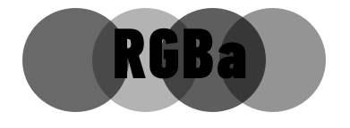

#HTML & CSS BASICS 

```
<p>Hello world!</p>
```

---


##Introductions

<div align="center"></div>

---

##Meet the Instructor

**Instructor:** Jenn de la Fuente

- Email: designs@jrosebud.com
- Website: http://jenndelafuente.com
- Twitter: [@dabblingdesign](http://twitter.com/dabblingdesign)

---

##Where to Find These Slides!

If you'd like to refer to these slides later, you can find them at:

**http://jrosebud.github.io/wonderwomen/lesson**

----

###You must have a text editor of some variety for this workshop!

If you don't, get Sublime Text at [http://www.sublimetext.com/](http://www.sublimetext.com/) (Mac only)

PC folks, you can get [Brackets](http://brackets.io/).

---

##HTML Basics

---

##HTML Syntax


---

##HTML Syntax


---

##Content Tags

Heading Elements

```<h1>```Largest Heading```</h1>```

```<h2>``` . . . ```</h2>```

```<h3>``` . . . ```</h3>```

```<h4>``` . . .```</h4>```

```<h5>``` . . . ```</h5>```

```<h6>```Smallest Heading```</h6>```

--

##Content Tags

Text Elements

```<p>```This is a paragraph```</p>```

```<br>``` This is a line break. Notice it doesn't need a closing tag.

--

##Content Tags

Unordered list

```<ul>``` ```</ul>```

In other words, a bulleted list. It looks like this:

- List item
- List item

--

##Content Tags

Unordered list item

```
<li>First item</li>
<li>Next item</li>
```


--

##Content Tags

Links

 ```<a href="Link">```First item```</a>```
 
 If you want a link to open in a new window or tab, you add ```target="_blank"```.
 
 ```<a href="link" target="_blank">Item</a>```


--

##Content Tags

Images

To put an image on an HTML page, you use the `````` tag:

``````

The src is the path to the image.

--

##Content Tags

Other helpful tags

You might want to put all your content inside one tag. I like to use the ```<section>``` tag or ```<div>``` tag for this.

---

##HTML Basics - Images

The `img` tag requires a `src` attribute, which tells the browser where to find the image to be placed.

---

##HTML Basics - Images

How would you write the src?


*	There are different approaches to specifying an image location
			
---

##HTML Basics - Images

*	Inside ```webroot```, a relative path could be used:
	
####``````

---

##HTML Basics - Images
Relative Path
	


<aside class="notes">

* Given this folder structure the same image would be `````
* 
Note that ```..``` means to go up a directory, and can be used repeatedly: `../..` would go up two directories.
</aside>


---


##HTML Basics - Images
Full URL

		
		
<aside class="notes">
For linking to images, make sure that you have permission to use the image in this way. Even then, it is often better to host a copy of the same image, rather than link to another server, because it reduces dependency.
</aside>

---

##HTML Basics - Images

```alt``` attribute

	
	
The `alt` attribute is for visually impaired people who have to browse the internet using a text reader. Since they can't see the photo, the text reader reads the alt text to them. Generally, put the description of the photo (for instance, "Company Logo") as the `alt` attribute.

The ```alt``` attribute is also good for Google indexing.

---

##HTML Basics - Images

Reasons an image may not load: 

*	There was a connection error, the browser didn't download the image.

*	The file was not found, perhaps because the image got moved elsewhere and the page wasn't updated yet to reflect the change.

*	The user is running a text-based browser such as an older phone with a WAP-style browser, or a non-graphical browser like lynx.

*	The user is using a screen reader because she has low vision, which will read the `alt` text aloud or present it through a braille reader.

---

##HTML Basics - Images

There are three main image file formats:

---

##Image File Formats

####.png

* Supports transparency and is still high-quality. Use it for logos or icons, or anything that needs to be high-quality and has to have a transparent background.

<aside class="notes">
Supports transparency and semi-transparency, great for logos, icons, and repeating background tiles. Almost always preferable to a `gif`, unless semi-transparency is not needed, and the `gif` format is significantly smaller.
</aside>

---

##Image File Formats


####.gif

*	Can have basic transparency, typically a `png` is used instead. You can of course use this for animated gifs. But don't use it for photos because the quality is terrible!

---

##Image File Formats

####.jpg

* Web format for all photos. Be reasonable with your sizing! Don't upload something that's 3MB. In general, a good rule of thumb is no more than 1200 pixels wide at 72 dpi resolution. If you're worried about retina screens, save your photos at 125 or 150 dpi.

<aside class="notes">
No transparency, can be stored at different compression levels with varying amounts of "lossy-ness", typically the best format for photos. (Try to balance between photo quality and file size.)
</aside>

---

##HTML5-Specific Tags

As mentioned in a previous class, there are some tags that were introduced when HTML5 became the new web standard. Here are a few of them:

`<header>` ... `<header>`

`<footer>` ... `<footer>`

`<section>` ... `<section>`

`<article>` ... `<article>`

---

##Basic HTML Page Structure

There are a few other tags you should be aware of and starting to use when you code your pages. There is a basic structure to HTML, and it goes something like this:

`<html>`

`<head>`
`</head>`

`<body>`
`</body>`

`</html>`

---

##Basic HTML Page Structure

In general, **all** your written HTML goes inside the `<html>` tags.

The `<head>` tags are reserved for things that are important but don't necessarily render onto the page. The `<head>` is often where CSS stylesheets are linked, scripts get linked, and the `<title>` ... `</title>` tag resides, which puts a title in the tab or top bar of a browser window.

The `<body>` tag is the body of your site ... in other words, it's where all the stuff the general public actually sees and what a browser renders.

---

##CSS

If HTML is the framework of a house, CSS is the paint and other things that makes it a unique house. (Is it red? How many bedrooms?)

---

##CSS


---


##CSS

Where does CSS go?

* Inline
* In the `head`
* In a separate file


<aside class="notes">
CSS should go in a separate file. We're going to start by placing them in the head for convenience and to learn the syntax. We'll show inline styles at the end, just to demonstrate.
</aside>

---

##CSS

Using a separate CSS file

Its best practice to put CSS in its own file and link to it from the `<head>`.

```<link rel="stylesheet" href="style.css">```
	
<aside class="notes>
"The `link` tag needs two attributes: `rel="stylesheet"` and an `href` attribute.

The `href` attribute value works very similarly to linking to an image, or to another page.
</aside>

---

##CSS Break Down

```
p {
	color: red;
	font-weight: bold;
}
```
---

##CSS Break Down

The **selector**, `p` in this case, specifies what parts of the HTML document should be styled by the declaration. This selector will style all `p` elements on the page.

---

##CSS Break Down

The **declaration block** here is:

```
{
	color: red;
	font-weight: bold;
}
```

**Declarations** go inside curly braces.

---


##CSS Break Down

#### Declarations

This example has two declarations. Here's the first:

```
color: red;
```

<aside class="notes">
Every declaration is a **property** followed by a **value**, separated by a colon, ending in a semicolon.

In this declaration, we are setting the `color` **property** to the **value** `red`.
</aside>

---


##CSS Break Down

Let's look at the second declaration:

```
font-weight: bold;
```

<aside class="notes">

What style **property** are we specifying here?

What **value** are we setting that **property** to?

Try writing a new set of styles for another element, like an `h1`.

</aside>

---

##Cascading Style Sheets (CSS)
###Colors

Colors can be specified in CSS in a variety of ways:


<aside class="notes">
* keyword
* hex codes
* rgb
* hsl
* rgba
* hsla

</aside>

---

##Color
###Color Keywords

These are used less frequently, but are handy for basic colors like `black` and `white`. There are several

See [here](http://msdn.microsoft.com/en-us/library/ie/aa358802.aspx) for more

---

##Color
###Hex Codes (RGB)


<aside class="notes">
"Hex" values are so-called because they use hexadecimal, or base-16, to describe the color values for red, green, and blue. Each of the 3 color values is expressed by two hexadecimal digits, from `00` (no color) to `FF` (full color), and are written in the order red, green, then blue, after an initial `#` sign.

Hex values can be abbreviated to only 3 digits if each digits is doubled. So `#FFFFFF` (white) can be expressed more succinctly as `#FFF`, and `#000000` (black) can be expressed as `#000`. `#FA6198`, however, cannot be abbreviated without altering the color.

</aside>

---

##Color
###RGB Color Values

####```rgb(0,0,0)```

*	The first value is red, the second green, the third blue.
 
*	Each value can range from 0 to 255, which expresses the same number of color steps as 00 to FF in base-16.


<aside class="notes">
FF in base-16 is equivalent to 255 in base-10.

In RGB, `rgb(0,0,0)` is black, `rgb(255,255,255)` is white, `rgb(255,0,0)` is red, etc.

White-space is allowed *inside* the parentheses, so `rgb(255, 0, 0)` will do just as well.
</aside>

---

##Color
###RGBa Colors


*	RGBa works identically to RGB, expect that it takes a 4th value called the "alpha".
*	This is a value between 0 and 1 which will be used to determine a color's opacity on the page. 0 is completely transparent (invisible), 1 is totally opaque (solid). 0.5 would be 50% opacity.




<aside class="notes">
0 is completely transparent, and 1 being solid. 0.5 or .5 is 50% opacity.

Thus, __rgba(0,0,0,.25)__ is black at 25% opacity and __rgba(255, 255, 255, 0.8)__ is white at 80% opacity.

The alpha value can be in decimal form but cannot use a percentage. When a decimal is used, the leading zero is optional.
</aside>

---

##Fonts

There is a set of basic fonts that can be read across just about all browsers.

To declare a font for a webpage, you usually assign it to the ```<body>``` tag using the ```font-family``` attribute, like this:

```
body {
    font-family: "Georgia", serif;
}
```

---

##Web Safe Fonts

There are about 12 fonts that can be safely declared in the font-family attribute because they're available across all browsers. You can read more about that here:

http://www.w3schools.com/cssref/css_websafe_fonts.asp

You can also use Google Fonts:

http://google.com/fonts

